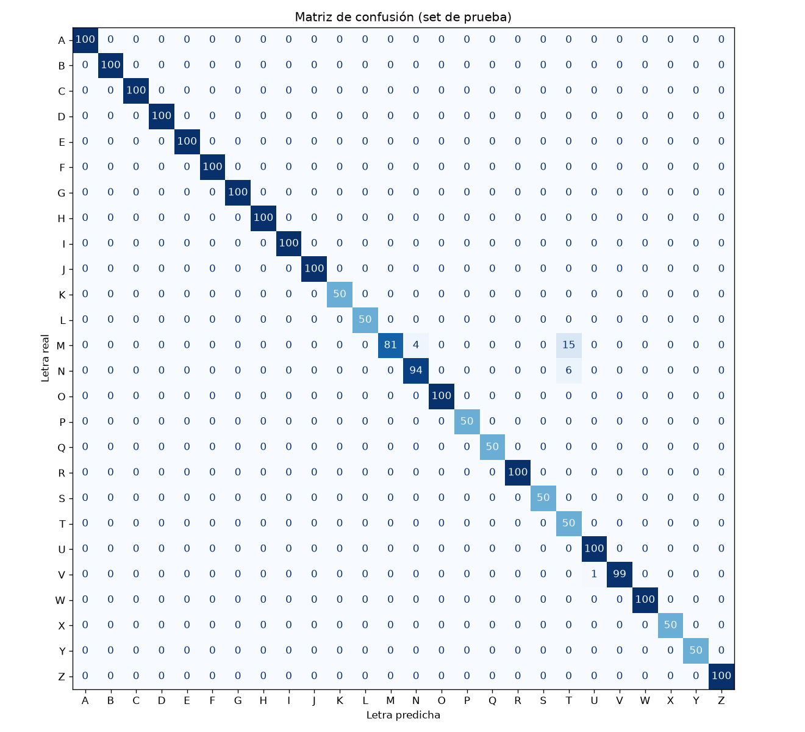

# Hand Tracking for Sign Language

Traduce el alfabeto dactilológico de la lengua de señas a texto en tiempo real, usando solo una cámara web y la CPU.

<p align="center">
  
</p>

## ¿De qué se trata?

La idea es facilitar la comunicación en entornos digitales (videollamadas, mensajería, formularios) entre personas sordas y personas que no manejan lengua de señas, convirtiendo las señas en subtítulos sin necesidad de un intérprete presente.

En vez de clasificar la imagen completa, el sistema usa [MediaPipe](https://ai.google.dev/edge/mediapipe/solutions/vision/hand_landmarker) para encontrar los **21 puntos clave (landmarks)** de la mano y entrena un clasificador sobre esas coordenadas. Esto tiene tres ventajas:

- Es liviano: corre fluido en tiempo real sin GPU.
- Necesita pocos datos: unos cientos de muestras por letra bastan.
- El fondo y la ropa casi no influyen, porque el clasificador solo ve la geometría de la mano.

**El modelo se entrena con tus propias señas.** Cada persona hace las letras a su manera, tiene manos de otro tamaño y usa otra cámara con otra iluminación, así que el repositorio no trae un modelo entrenado: lo armas tú en unos minutos con el pipeline incluido.

## Instalación

Necesitas **Python 3.12** (ni anterior ni posterior: NumPy pide 3.12 o superior y MediaPipe todavía no es compatible con 3.13) y una cámara web. Funciona en Windows, Linux y macOS.

> **En macOS:** se necesita macOS 13 Ventura o superior. Instala Python 3.12 desde [python.org](https://www.python.org/downloads/) o con `brew install python@3.12`, y crea el entorno con `python3.12 -m venv .venv` (en Mac el comando `python` suele no existir fuera de un entorno virtual). La primera vez que ejecutes un script, macOS pedirá permiso de cámara para la Terminal (o para VS Code) y el script se cerrará con el aviso `not authorized to capture video`. Es normal: activa el permiso en *Configuración del Sistema > Privacidad y seguridad > Cámara*, cierra la Terminal por completo con `Cmd+Q`, vuelve a abrirla y ejecuta de nuevo. Si el script abre la cámara de tu iPhone (Continuity Camera) en vez de la del Mac, usa `--camera 1`.

```bash
git clone https://github.com/hayealonso/HandTrackingForSignLanguage.git
cd HandTrackingForSignLanguage
python -m venv .venv
```

Activa el entorno virtual:

```bash
# Windows
.venv\Scripts\activate
# Linux / macOS
source .venv/bin/activate
```

Instala las dependencias:

```bash
pip install -r requirements.txt
```

## Uso

### 1. Graba tus señas

El repositorio incluye mi dataset como ejemplo (`landmarks_data.csv` y `landmarks_data_clean.csv`). Como las muestras nuevas se agregan al final del CSV, **bórralos antes de capturar** si quieres un dataset solo con tus señas:

```bash
# Windows (PowerShell)
Remove-Item landmarks_data.csv, landmarks_data_clean.csv
# Linux / macOS
rm landmarks_data.csv landmarks_data_clean.csv
```

Luego abre la captura:

```bash
python collect_data.py
```

Presiona la tecla de la letra que quieres grabar (A-Z), acomoda la mano y presiona `Espacio` para empezar. El script guarda muestras mientras tu mano esté visible y se pausa solo al llegar al límite por letra (500 por defecto, se cambia con `--samples`). `Espacio` también sirve para pausar, y `Esc` para salir. Puedes cerrar y volver a abrir el script: retoma donde quedaste.

Algunos consejos para que el modelo salga más robusto:

- Mueve un poco la mano mientras grabas (más cerca, más lejos, levemente girada), así el modelo aprende variaciones de la misma seña.
- Graba en el lugar y con la luz donde lo vas a usar.
- Si quieres que funcione en distintos lugares, graba cada letra en más de una sesión.

### 2. Limpia y entrena

```bash
python clean_data.py   # descarta filas inválidas y genera landmarks_data_clean.csv
python train.py        # entrena, muestra la precisión y guarda asl_model.pkl
```

Si solo quieres probar el proyecto sin grabar nada, puedes saltarte el paso 1 y entrenar con el dataset de ejemplo. Eso sí, va a funcionar mejor mientras más se parezcan tus manos y tu forma de hacer las señas a las mías.

### 3. Ejecuta el reconocimiento

```bash
python main.py
```

### Controles

| Tecla | Acción |
|---|---|
| `Espacio` | Agrega un espacio entre palabras |
| `Backspace` | Borra el último carácter |
| `C` | Limpia todo el subtítulo |
| `Esc` | Cierra el programa |

Para escribir una letra, mantén la seña quieta hasta que se llene la barra de progreso. Para repetir una letra (como en "LL"), baja la mano un instante y vuelve a hacer la seña.

## Cómo funciona

El proyecto es un pipeline de cuatro scripts que se ejecutan en orden, más dos módulos de apoyo:

| Archivo | Qué hace |
|---|---|
| `collect_data.py` | **Captura.** Abre la cámara, detecta la mano y guarda sus landmarks normalizados en `landmarks_data.csv`, etiquetados con la letra que elijas. |
| `clean_data.py` | **Limpieza.** Descarta filas con etiquetas inválidas o datos faltantes y genera `landmarks_data_clean.csv`. |
| `train.py` | **Entrenamiento.** Entrena el clasificador, lo evalúa con datos que no vio y guarda el modelo en `asl_model.pkl`. |
| `main.py` | **Reconocimiento.** Predice la letra en tiempo real, suaviza la predicción para evitar parpadeos y arma el subtítulo letra por letra. |
| `hand_features.py` | Normalización de los landmarks y cálculo de features, compartido por todos los scripts. |
| `classifiers.py` | Catálogo de clasificadores disponibles (Random Forest, SVM, red neuronal, etc.). |

### Del video a la letra

1. **Detección.** MediaPipe entrega 21 puntos (x, y, z) de la mano en cada frame.
2. **Normalización.** Las coordenadas se centran en la muñeca y se escalan según el tamaño de la mano, así da igual dónde esté en la imagen o qué tan cerca de la cámara. Si es la mano izquierda, se refleja para que quede como una derecha.
3. **Features.** A las 63 coordenadas se les suman las 210 distancias entre cada par de puntos, que describen la forma de la mano (qué dedos se tocan, cuáles están doblados).
4. **Clasificación.** El modelo entrega una probabilidad por letra; solo se acepta si supera el 70 %.
5. **Estabilización.** Se vota entre las últimas 12 predicciones y la letra se escribe cuando se mantiene estable durante 6 frames.

## Elegir el clasificador

`train.py` permite elegir el modelo y el conjunto de features:

```bash
python train.py --model svm          # SVM (por defecto)
python train.py --model rf           # Random Forest, el modelo original del proyecto
python train.py --model mlp          # red neuronal (perceptrón multicapa)
python train.py --model et           # Extra Trees
python train.py --model knn          # k vecinos más cercanos
python train.py --features raw       # solo las 63 coordenadas, sin distancias
python train.py --model mlp --tune   # busca los mejores hiperparámetros (más lento)
```

`main.py` detecta solo qué modelo y qué features se usaron, así que no hay que cambiar nada para usarlo. Para agregar un clasificador nuevo basta con sumarlo al diccionario `CLASSIFIERS` en `classifiers.py`.

## Resultados

Estos números son con el dataset de ejemplo: lo grabé yo mismo con las 26 letras (A-Z) hechas con la mano derecha como poses estáticas, unas 10.800 muestras en total. Con tus propias muestras los resultados van a ser distintos; `train.py` te muestra la precisión de tu modelo cada vez que entrenas.

Para medir la precisión de forma honesta, el set de prueba se separa por **bloques de video**, no por frames sueltos. Como los frames consecutivos son casi idénticos, separarlos al azar deja "copias" de los datos de prueba en el entrenamiento y la precisión sale inflada (entre 99,4 % y 99,9 % para cualquier modelo).

Accuracy promedio con validación cruzada de 5 folds sobre bloques de video no vistos:

| Clasificador | Solo coordenadas (`raw`) | Coordenadas + distancias (`dist`) |
|---|:---:|:---:|
| Random Forest | 95,7 % | 99,1 % |
| Extra Trees | 96,2 % | 99,0 % |
| k vecinos (kNN) | 96,1 % | 99,0 % |
| Red neuronal (MLP) | 97,8 % | 99,1 % |
| **SVM** | 98,4 % | **99,3 %** |

La combinación por defecto (SVM + distancias) comete unas **6 veces menos errores** que la versión original (Random Forest + coordenadas). Además, el modelo pesa 2 MB en vez de 44 MB.

<p align="center">
  
</p>

Los pocos errores que quedan se concentran en **M, N y T**: las tres son un puño cerrado y solo se diferencian por dónde queda el pulgar entre los dedos, algo que a veces ni MediaPipe logra ver bien.

## Tecnologías

- **[MediaPipe Hands](https://ai.google.dev/edge/mediapipe/solutions/vision/hand_landmarker)**: detección y seguimiento de los 21 landmarks de la mano.
- **OpenCV**: captura de video e interfaz.
- **scikit-learn**: clasificadores y evaluación.
- **pandas / NumPy**: manejo del dataset.
- **Pillow**: texto con fuentes TTF (con tildes) en la interfaz.
- **Matplotlib**: gráfico de la matriz de confusión.

## Limitaciones y próximos pasos

- **Solo señas estáticas.** Las letras que llevan movimiento (como la J o la Z) se grabaron como una pose fija. Para cubrirlas habría que modelar secuencias de frames, por ejemplo con una LSTM o un Transformer sobre ventanas de landmarks.
- **Modelo personal.** Cada modelo aprende las señas de quien lo entrenó, así que reconoce bien a esa persona pero puede costarle con otras. Para un modelo que sirva a cualquiera habría que juntar muestras de mucha gente distinta.
- **Una mano a la vez.** La mano izquierda se reconoce reflejándola, pero no hay soporte para señas con dos manos.
- **Sin corrección de texto.** El subtítulo se arma letra por letra; un corrector o modelo de lenguaje podría completar palabras y corregir errores.

## Autor

**Alonso Haye Retamal**, estudiante de Ingeniería Civil Eléctrica, Universidad de Chile.
